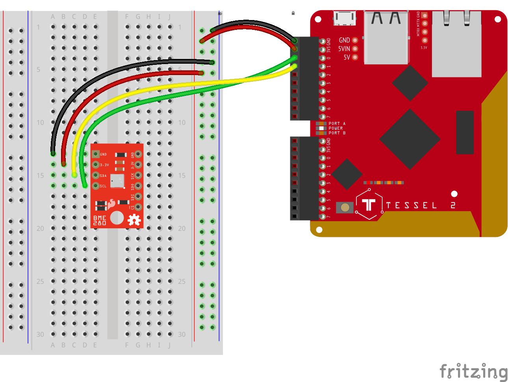

# tessel-bme-280

The [SparkFun BME280](https://www.sparkfun.com/products/13676) is
an Atmospheric Sensor Breakout to measure barometric pressure, humidity,
and temperature.

This library allows to interact with the BME280 connected to a tessel, using the official tessel library.

*Note:* the [`johnny-five`](http://johnny-five.io/) library includes ways to interact with BME280.
This library uses a lot of code from `johnny-five`.


_"Creative Commons BME280" by [sparkfun](https://www.sparkfun.com) is licensed under CC BY 2.0_

## Circuit



_"BME280 circuit (Tessel 2)" by [sparkfun](https://www.sparkfun.com) is licensed under CC BY 2.0_


## Usage

```js
const tessel = require('tessel');
const BME280 = require('tessel-bme-280');

const port = tessel.port.A; // Use the SCL/SDA pins of Port A

// Single mesure

// slaveAddress is an optional 2nd param, defaults to 0x77
const sensor = new BME280(tessel.port.A); 

/////////////////
// Event handler
/////////////////

// optional event handler
sensor.on('data', (values) => {
    // this method will be called when `measure()` is called,
    // or when every `delay` milliseconds when `every(delay)` is called
    // until `stop()` is called
    console.log('received ("data" event):', values);
});

//////////////////
// SingleMeasure
//////////////////
sensor.measure().then(
    // note that the 'data' event handler, if set, will still be triggered
    values => console.log('received (measure()):', values)
    // outputs: { temperature: 21.5, pressure: ..., altitude: }
    // units are celciusm ?? and meters
);

////////////////////
// multiple measure
////////////////////

// optional 2nd param: a callback function
recurrentSensor.every(delay, (values) => {
    // note that the 'data' event handler, if set, will still be triggered
    console.log('received (`every()` call):',values);
}); 

//... when you are ready to stop
setTimeout(() => {
    recurrentSensor.stop();
}, 4000)
```

# Why?

Why did I reinvent the wheel? All the functionalities are available from [`johnny-five`](http://johnny-five) library...

Because:
- I just wanted to play with my new Tessel, and get familiar with development boards (Tessel is my first one!! 🎉🤓🍾!!).
- I wanted to create a library that uses the official Tessel library, to get familiar with the API. This was before realizing all the humongous 
list of features already implemented by `johnny-five`...
- I thought that having a pure Tessel 2 library was a good idea. This was before understanding all the buffer operations needed...
- hmmm... why not?


